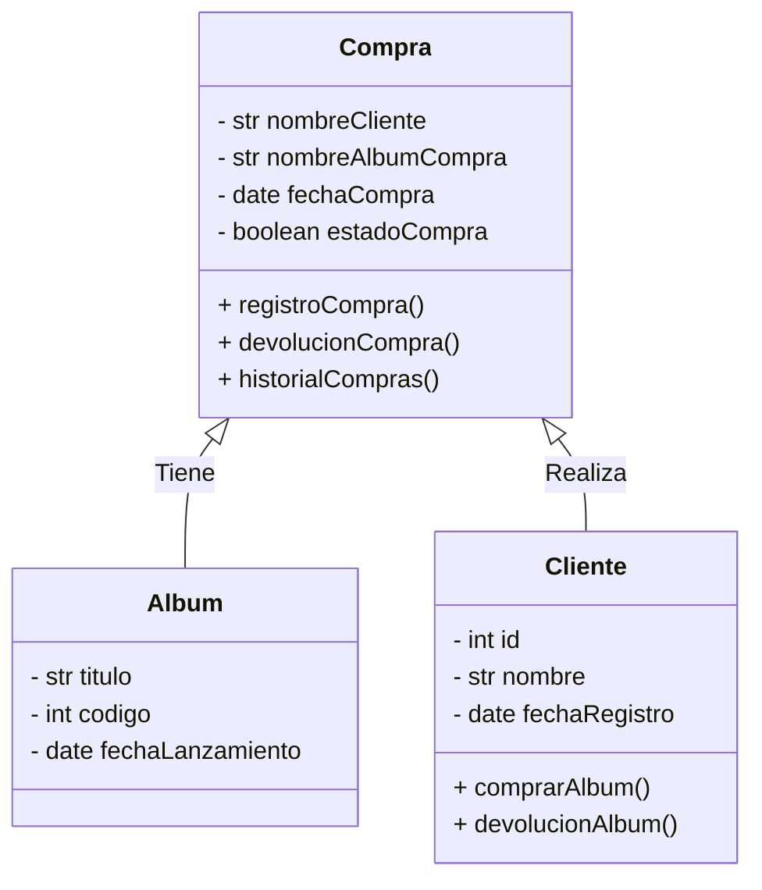

EJEMPLO TIENDA DE MUSICA

```mermaid
classDiagram
    Compra <|-- Album : Tiene
    Compra <|-- Cliente : Realiza

    class Compra {
        - str nombreCliente
        - str nombreAlbumCompra
        - date fechaCompra
        - boolean estadoCompra
        + registroCompra()
        + devolucionCompra()
        + historialCompras()
    }
    
    class Album {
        - str titulo
        - int codigo
        - date fechaLanzamiento
    }
    
    class Cliente {
        - int id
        - str nombre
        - date fechaRegistro
        + comprarAlbum()
        + devolucionAlbum()
    }
```